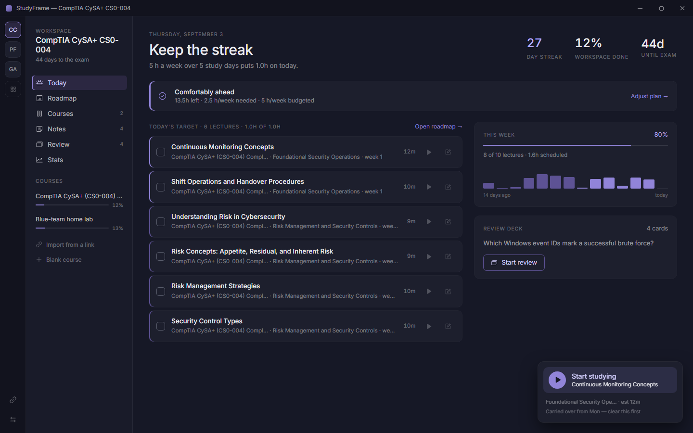
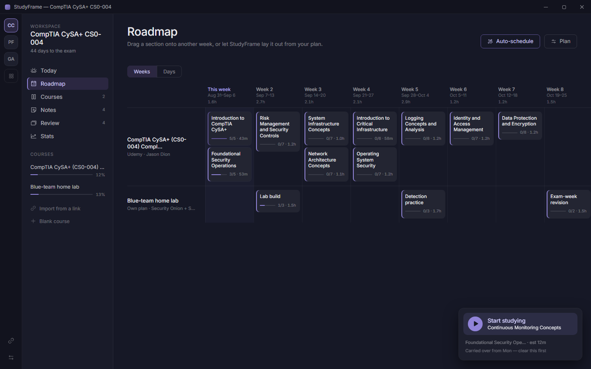
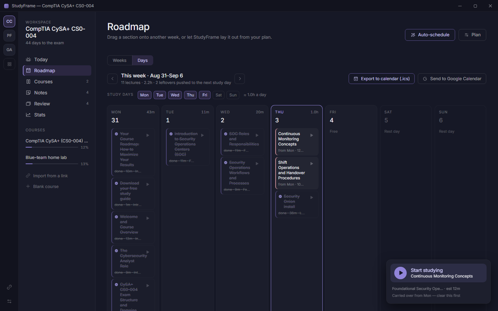
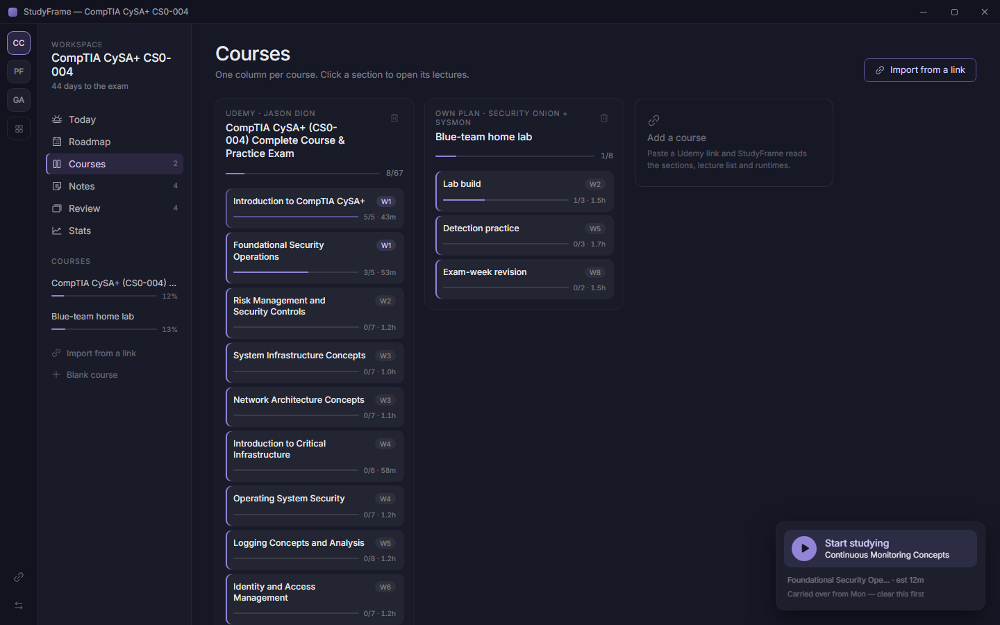
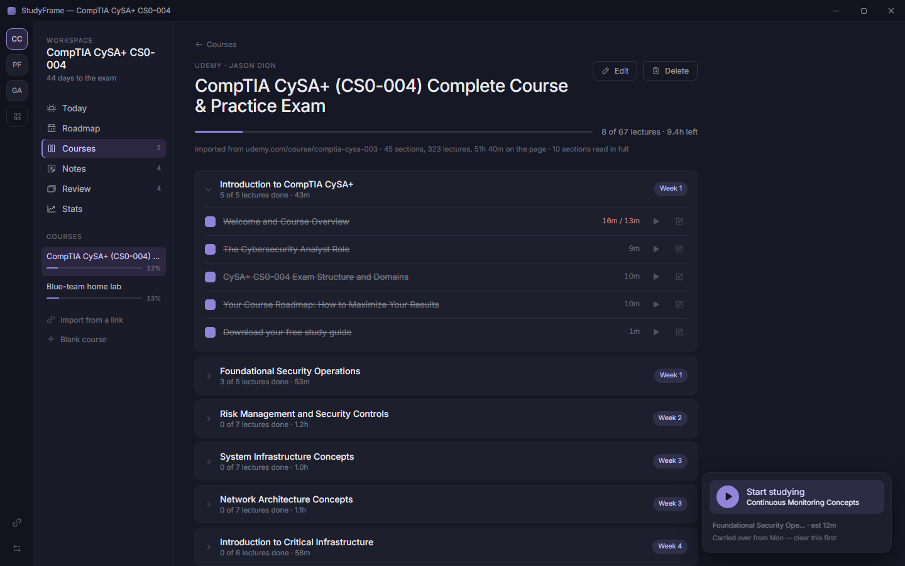
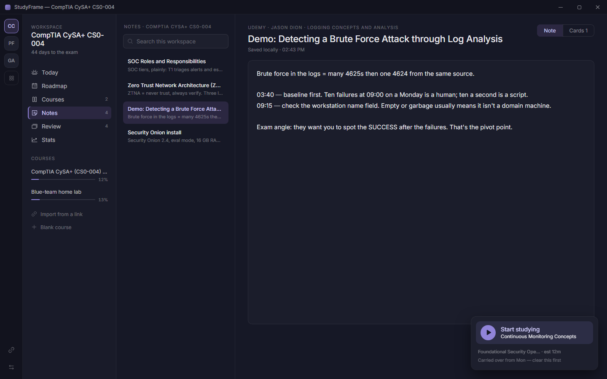
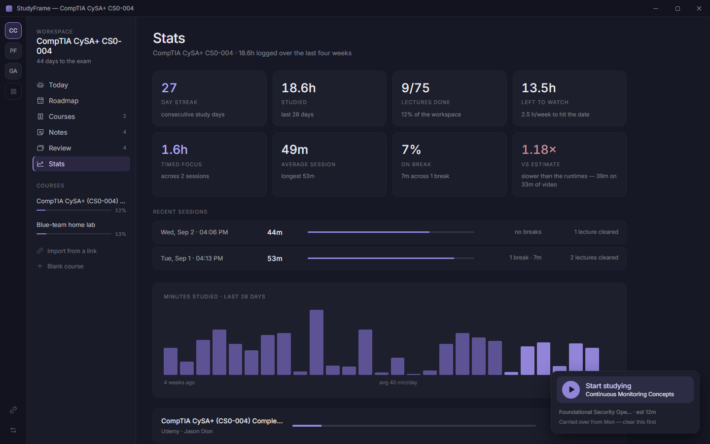

# StudyFrame

A free, local study planner for online courses. Point it at a Udemy course
(or any lecture list), tell it your exam date and how many hours a week you
actually have, and it lays every section out across weeks and days — no
spreadsheet, no subscription, no account.

Import once, then StudyFrame carries the rest: it tracks what you've
finished, tells you honestly whether your plan still fits before your exam,
keeps notes and flashcards next to each lecture, and times your study
sessions so you know where the hours went.

## Why it's easy to live with

- **Free and yours.** No account, no server, no subscription, nothing
  phoning home. Every course, note, card and session lives in one file on
  your machine.
- **One click to start studying.** The timer dock always knows what's next —
  first on today's plan, or carried over from a day you missed — so you never
  have to decide where to pick up.
- **Never a false green light.** If the numbers don't work — not enough
  weeks, not enough hours in a day — StudyFrame says so plainly and offers
  the specific fix (more hours, more study days, a later date), instead of
  quietly falling behind.
- **Notes and flashcards live with the lecture**, not in a separate app, and
  "Draft from note" turns your own notes into review cards automatically.
- **Portable.** Export a course of study to one file, move it to another
  machine, import it back — nothing is ever silently overwritten.

A native Windows app with the memory footprint of a browser tab (roughly
35 MB running), not an Electron app in disguise.



---

## Install

1. Download **`StudyFrame_1.0.0_x64-setup.exe`** from the
   [Releases](../../releases) page.
2. Double-click it. No admin prompt, no Node, no Rust, nothing else to set up
   first — it installs to your own user account.
3. Windows SmartScreen will warn you the first time because the installer
   isn't code-signed yet: click **More info → Run anyway**.
4. Launch StudyFrame from the Start menu or the desktop shortcut it created.

That's it — you're studying.

Prefer the `.msi` instead if you're deploying to several machines by policy
(Group Policy, Intune) rather than installing by hand.

---

## Uninstalling / removing everything

**Uninstall the app:** *Settings → Apps → StudyFrame → Uninstall*, or run
`uninstall.exe` directly from where it installed
(`%LOCALAPPDATA%\StudyFrame\`). This removes the program and both shortcuts.

> One packaging quirk: the uninstaller currently leaves the Start Menu
> shortcut behind as a dead link (a known gap in this version — the desktop
> shortcut is removed correctly). Delete it by hand if it bothers you:
> `%APPDATA%\Microsoft\Windows\Start Menu\Programs\StudyFrame.lnk`.

**Uninstalling does not delete your data on purpose** — so a reinstall (or a
different install method) picks up right where you left off. If you want a
completely clean removal, also delete:

| What | Where |
| --- | --- |
| Your library — courses, progress, notes, cards, sessions | `%APPDATA%\com.studyframe.app\` |
| The embedded browser's own cache (WebView2) | `%LOCALAPPDATA%\com.studyframe.app\` |

Both are just folders — delete them in File Explorer or with
`rmdir /s "%APPDATA%\com.studyframe.app"` /
`rmdir /s "%LOCALAPPDATA%\com.studyframe.app"` in a terminal.

**If you ran `studyframe.exe` on its own instead of installing** (see below),
there's no installed program or shortcuts to remove — just delete the
`.exe` file itself. Your data still lives at the same `%APPDATA%` path above,
since that has nothing to do with how the app was launched, so delete it too
if you want a clean slate.

<details>
<summary>Running <code>studyframe.exe</code> without installing</summary>

The installer just wraps `studyframe.exe` — that file works as a standalone
binary too. Copy it anywhere and double-click it directly: no installer, no
admin, nothing to set up. It needs the WebView2 Runtime, which Windows 10 and
11 already ship with, so this works on almost any machine out of the box.
The only things you lose going this route are the Start Menu entry, desktop
shortcut and `.studyframe.json` file association — everything else is
identical, including where your data is saved.

</details>

---

## Screens

| | |
| --- | --- |
|  |  |
|  |  |
|  |  |

---

## Importing a course

Two routes to the same reviewed draft.

**From a link.** A Udemy page carries only its first ten sections; the rest are
fetched when you click "N more sections". StudyFrame calls that same public
endpoint directly, so a link gives every section.

**From a paste.** Always available, and the fallback when a fetch fails. Copy
the course curriculum's HTML or plain text and paste it in — StudyFrame
handles glued headings, preview badges, bare `mm:ss` runtimes, objective tags
and checkpoints, and tells you plainly if the copy came up short against the
page's own totals.

Nothing is ever added straight from a parse — you always get a reviewed
draft first, with sections and weeks you can adjust before it's added.

---

## The demo library

Want to see it populated before importing your own courses? Open the
transfer dialog (the arrows icon at the bottom of the workspace rail),
choose **Import from file…**, and load
`samples/demo-library.studyframe.json` — a three-workspace library with
real progress, notes and cards already in it.

A first launch is deliberately empty otherwise — one workspace with no
courses, its study plan open — rather than seeded with material you didn't
create.

---
---

# For developers

Everything below is for building StudyFrame from source or contributing to
it — not needed to just use the app.

## Building it

```
npm install
npm run dev          # the UI in a browser, on http://localhost:1420
npm run typecheck    # tsc --noEmit, strict
npm run build        # typecheck, then the production bundle into dist/
npm test             # 108 checks across four suites (see Tests below)
```

`npm run dev` renders every screen and all of the planner logic in an
ordinary browser tab, which is convenient for UI work — but it's a
development aid, not how the app is meant to be used day to day. Three
things need the real desktop shell and are inert in a browser: reading a
curriculum from a link, native file dialogs, and the durable file-backed
store (a browser falls back to `localStorage` instead).

### The desktop app and the Windows installer

Needs a **Rust toolchain**, and a **Windows machine** for the `.exe`/`.msi`:

```
rustup default stable
npm run tauri dev            # the real app, with the file-backed store
npm run tauri build          # the installers
```

Output:

```
src-tauri/target/release/bundle/nsis/StudyFrame_1.0.0_x64-setup.exe
src-tauri/target/release/bundle/msi/StudyFrame_1.0.0_x64_en-US.msi
```

Ship the NSIS one for consumers, the MSI for anyone deploying by policy.
`installMode: currentUser` avoids the UAC prompt, and `embedBootstrapper` means
WebView2 installs itself on a machine that lacks it — so it stays one click.

Unsigned installers trigger SmartScreen. Set `WINDOWS_CERTIFICATE` and
`WINDOWS_CERTIFICATE_PASSWORD` in CI and the bundler signs.

Rust embeds the absolute source path of every crate it compiles into panic
locations, which end up as plain strings in the shipped binary — including
your Windows username, if that's part of the build path. Building for actual
distribution, not just local testing, set this first:

```
$env:RUSTFLAGS = "--remap-path-prefix=C:\Users\<you>=user"    # PowerShell
```

**The app icon.** `src-tauri/icons/` holds the generated set; the source is
`scripts/icon-source.html` (an inline SVG on the brand gradient) plus
`scripts/render-icon.mjs`, which rasterizes it to a 1024×1024 PNG via
Playwright. To change it, edit the SVG, then:

```
node scripts/render-icon.mjs
npx tauri icon scripts/icon-1024.png
```

`tauri icon` also writes iOS/Android/Store assets this project doesn't use —
delete everything under `src-tauri/icons/` except `32x32.png`, `128x128.png`,
`128x128@2x.png`, `icon.ico` and `icon.png` afterwards. Cargo won't notice the
new icon on its own (nothing it tracks changed, only the icon file's bytes),
so force it to re-embed with `cargo clean -p studyframe --release` before the
next `tauri build`.

## Layout

```
src/
├── app/          shell: title bar, workspace rail, sidebar, view switching
├── views/        Today, Roadmap (weeks + days), Courses, CourseDetail,
│                 Notes, Review, Stats, Launcher
├── dialogs/      StudyPlan, ImportCourse, Transfer
├── timer/        the dock and its clock state
├── planner/      pacing, feasibility, auto-schedule, day plan, dates, ics
├── store/        state, persistence, migration, import/export, parsers
├── theme/        tokens as CSS custom properties, base and component styles
├── components/   shared primitives
└── lib/          formatting, file dialogs, card drafting
src-tauri/
├── src/
│   ├── main.rs
│   ├── lib.rs        commands, window state, single instance, file association
│   ├── storage.rs    atomic writes, backups, recovery
│   └── curriculum.rs course fetching
├── icons/
├── capabilities/
└── tauri.conf.json
scripts/          icon source + generation, one-off screenshot capture
tests/            the verification suites
samples/          an importable demo library
```

`planner/` is pure functions over a workspace, so the pacing, feasibility and
day-plan rules are testable without a UI. Progress percentages, week loads and
pace figures are always derived from the tree, never stored.

## Durability

The durability rules are all in `src-tauri/src/storage.rs`:

- **Atomic writes.** Serialize to `.tmp`, flush and fsync, roll `library.json`
  to `.bak`, rename the temp into place. A rename is atomic on NTFS, so a crash
  mid-write leaves the previous good version, never a half-written file.
- **Debounced autosave.** 400ms after a mutation, and immediately on window
  close, session end and workspace import.
- **Read with fallback.** `library.json`, then `.bak`, then the newest daily
  snapshot — and the UI says which one it recovered. It never starts empty in
  silence.
- **Truncation guard.** A write smaller than half the last good save is refused
  unless the user just deleted something.
- **Never destroy on upgrade.** The original is copied to
  `backups\pre-upgrade-<version>.json` before a migration rewrites it.

## Tests

`npm test` starts the dev server, runs four suites against the real modules,
and tears it down. It needs a Chromium; set `CHROME_PATH` to reuse a system one
instead of `npx playwright install chromium`.

| Suite | Covers |
| --- | --- |
| `planner` | formatting and pluralisation, DST-safe calendar math, both **Not possible** verdicts, the pace ladder, auto-schedule and its 1.25 tolerance, day-plan anchoring and rollover, the .ics shape, both curriculum parsers, import validation, migration and log rolling |
| `app` | workspace isolation, the export → wipe → import round trip, timer sessions with breaks and per-lecture actuals, `Done` advancing the clock, cascade deletes |
| `import` | the paste route end to end, coverage reporting and the short-read warning, id prefixing |
| `layout` | no sideways page scroll on any view at 1180 and 1440, the first-run state, a visible focus ring on every tabbed control |
